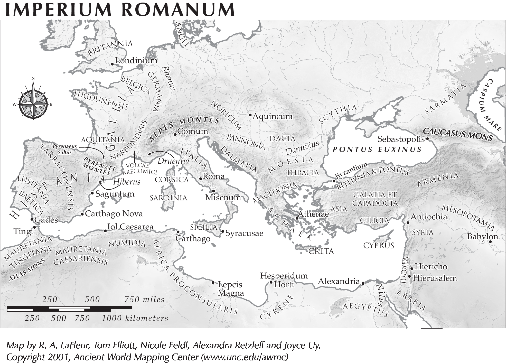

Memorize the below listed locations on this map of the area of the Roman empire.

| Regions (ALL CAPS) |  |  |  |
|:------|:------|:------|:------|
|- Africa Proconsularis     | - Cyrene     | - Iudaea     | - Numidia|
|- Arabia     | - Dacia     | - Macedonia     | - Pannonia|
|- Armenia     | - Dalmatia     | - Mauretania     | - Scythia|
|- Asia     | - Gallia     | - Mesopotamia     | - Syria|
|- Britannia     | - Hispania     | - Noricum     | - Thracia|

