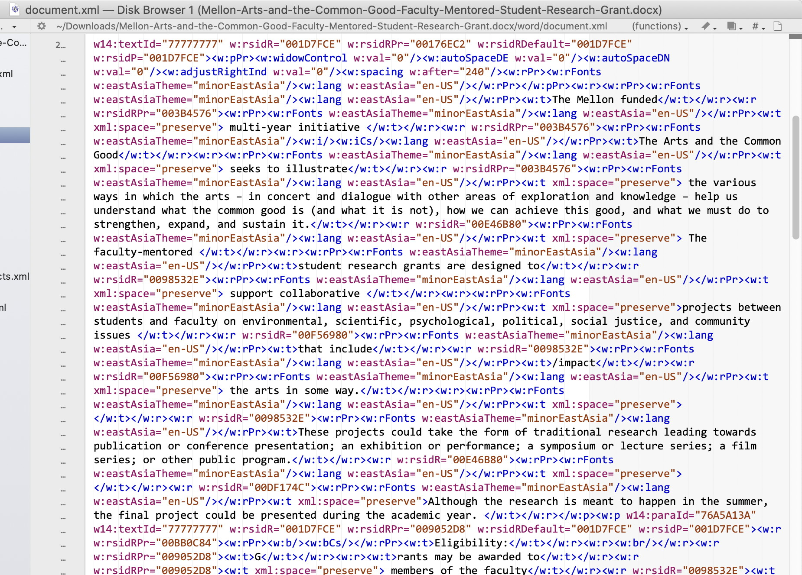
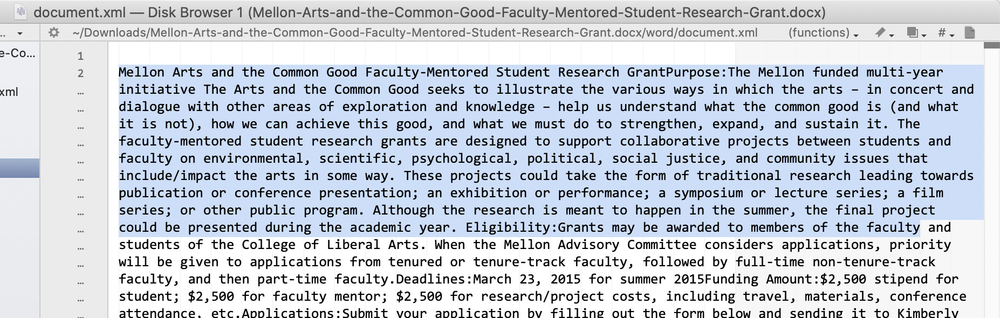
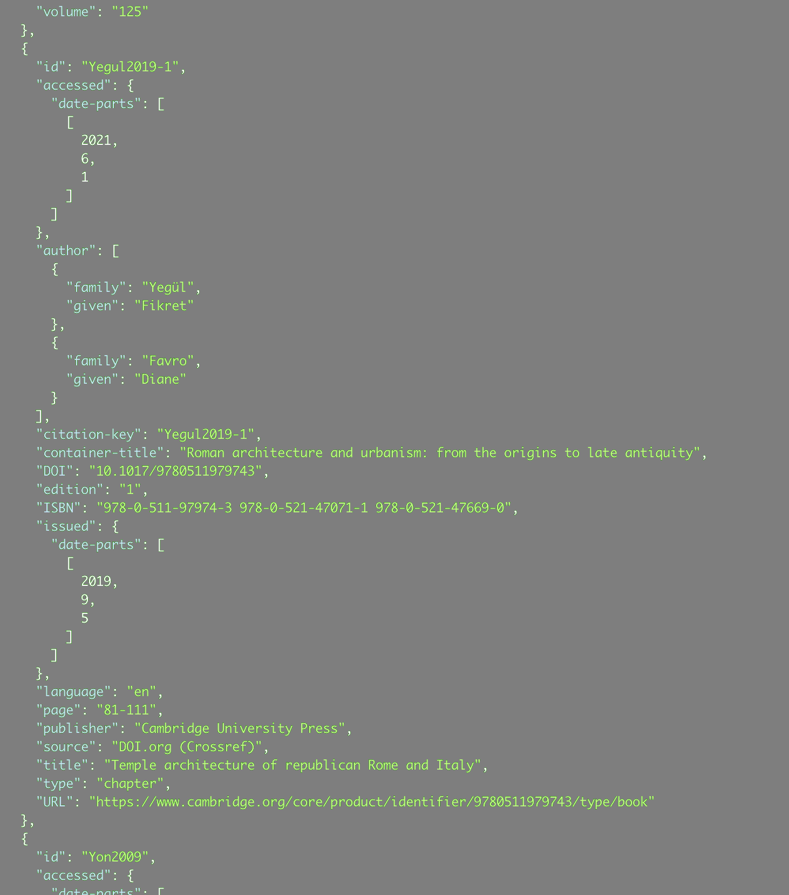
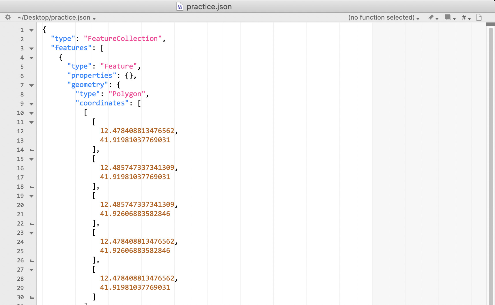

---
title: Use more text
author: John D. Muccigrosso
date: May 2022
...

### Why use text?

1. It can be read by any computer or device
1. It’s future proof, since...
	1. Computers will always be able to read it
	1. 👀 You can read it yourself
1. It can be synced to all your devices
1. Files are small
1. Easy to see what's changed
1. There are standard data formats for lots of uses
1. You don't need expensive software to work on it
1. There are tools (edit, display, count, process)
1. You won't waste time playing with <span style="font-family:Comic Sans MS; size:larger; color:red">Comic Sans</span>

# Word processing: Markdown

## What is it?

- Markdown is a lightweight version of a *markup* language (get it?), designed after conventions that had mostly already been established, and meant to be easily readable and convertible into other markup languages (mainly HTML, the language of the web).

- Like other markup languages, it separates **form** from **content**.

## ProfHacker

### a.k.a. Lincoln Mullen

-----

What he [says](http://www.chronicle.com/blogs/profhacker/markdown-the-syntax-you-probably-already-know/35295):

- almost anything you need to do, you can do in a plain text file

. . .

## [John Gruber](http://daringfireball.net/projects/markdown/)

What he says about it:

- text-to-HTML conversion tool
- write using an easy-to-read, easy-to-write plain text format
- originally worked (and defined by a script, written in the Perl programming language

## Some Examples

-----

Paragraphs are just one or more consecutive lines of text, separated by one or more blank lines.


- Lorem ipsum dolor sit amet, consectetur adipisicing elit, sed do eiusmod tempor incididunt ut labore et dolore magna aliqua. Ut enim ad minim veniam, quis nostrud exercitation ullamco 
 
    laboris nisi ut aliquip ex ea commodo consequat. Duis aute irure dolor in reprehenderit in voluptate velit esse cillum dolore eu fugiat nulla pariatur. Excepteur sint occaecat cupidatat non proident, sunt in culpa qui officia deserunt mollit anim id est laborum.

-----

- Headings are lines preceded by one or more hash marks `#`
	- \# Heading
	- Add more hash marks to increase heading level
		- \#\# Second Level
- Lists are lines preceded by hyphens `-`
- Emphasize words by surrounding them with `*` or `_`:
	- \*emphasis\*
		- This usually is translated as *italics*
- Strong emphasis needs two `*`: 
	- \*\*strong\*\*
		- This usually is translated as **bold**


## But my papers need more complex formatting!

-----


-----

## More to come...

Turns out Markdown can be combined with some other free tools to make it even more powerful and more useful for students and scholars.  

. . .

I even made this slideshow in it!

## BTW: MS Office uses text

```
> unzip -l Mellon-Arts-and-the-Common-Good-Faculty-Mentored-Student-Research-Grant.docx
Archive:  Mellon-Arts-and-the-Common-Good-Faculty-Mentored-Student-Research-Grant.docx
  Length      Date    Time    Name
---------  ---------- -----   ----
     2119  01-01-1980 00:00   [Content_Types].xml
      735  01-01-1980 00:00   _rels/.rels
     1766  01-01-1980 00:00   word/_rels/document.xml.rels
    27166  01-01-1980 00:00   word/document.xml
     1384  01-01-1980 00:00   word/footer1.xml
     1384  01-01-1980 00:00   word/header2.xml
     1384  01-01-1980 00:00   word/header1.xml
     1384  01-01-1980 00:00   word/footer2.xml
   121940  01-01-1980 00:00   docProps/thumbnail.jpeg
     7643  01-01-1980 00:00   word/theme/theme1.xml
     2353  01-01-1980 00:00   word/settings.xml
    16445  01-01-1980 00:00   word/stylesWithEffects.xml
    15579  01-01-1980 00:00   word/styles.xml
      737  01-01-1980 00:00   docProps/app.xml
     2962  01-01-1980 00:00   word/fontTable.xml
     6651  01-01-1980 00:00   word/numbering.xml
      431  01-01-1980 00:00   word/webSettings.xml
      745  01-01-1980 00:00   docProps/core.xml
---------                     -------
   212808                     18 files
```

## BTW: MS Office uses text

{ height=75% width=75% }

## BTW: MS Office uses text

{ height=75% width=75% }

# Encoding tabular data

## A table

Last Name|First name|Age
---------|----------|----
Muccigrosso|John|43
Kolmar|Wendy|31
Reay|Danielle|25

-----

## CSV - comma-separated values

```
"Last Name", "First name", "Age"  
"Muccigrosso","John","43"  
"Kolmar","Wendy","31"  
"Reay","Danielle","25"  
```

- Separator can really be anything (tab is common)

# JSON - javascript object notation

## Format

- Object: Pairs of **key** and *value*
	- {**"lastname"**: *"Muccigrosso"*, **"firstname"**: *"John"*, **"Age"**: *"43"*}
- Array: basically a list of things

	- ["John", "Wendy", "Danielle"]
- You can have an object made of multiple arrays
	- {  
"name":"DH Committee",  
"members":["John", "Wendy", "Danielle"]  
}

## An example from Zotero



# Space: geoJSON

Spatial information can be also stored as text and interpreted as pandoc does markdown, using JSON format to make **geoJSON**.

## An example of spatial data



-----

Let's play with maps here: [geojson.io](https://geojson.io/)

# Checking for changes

diff

# Some tools

- [BBEdit](https://bbedit.com/) (for Macs) -  text editor
- LaTeX - for complex formatting of documents (like math papers)
- [markdown](http://markdownguide.org) - remarkably competent mark-up language for word-processing
- [pandoc](https://pandoc.org) - converts from plaintext to multiple formats like PDF, Word, PowerPoint

