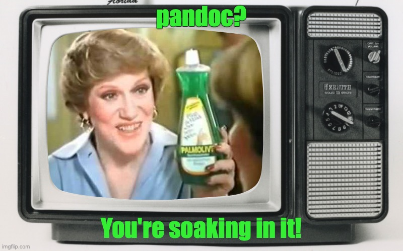
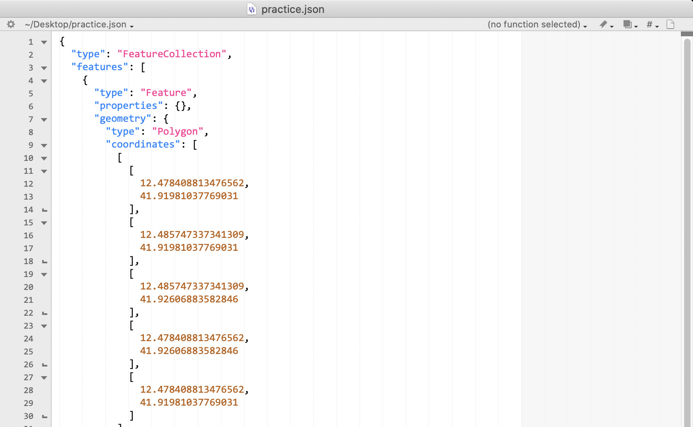

## GitHub {data-background-image="images/original.png" data-background-size="contain"}

. . .

Say hello to Octocat

. . .

And hold on a minute


# Let's talk about text

<span style="font-family:Courier">Lorem ipsum dolor sit amet, consectetur adipisicing elit, sed do eiusmod tempor incididunt ut labore et dolore magna aliqua. Ut enim ad minim veniam, quis nostrud exercitation ullamco laboris nisi ut aliquip ex ea commodo consequat. Duis aute irure dolor in reprehenderit in voluptate velit esse cillum dolore eu fugiat nulla pariatur. Excepteur sint occaecat cupidatat non proident, sunt in culpa qui officia deserunt mollit anim id est laborum.</span>

## Plaintext

. . .

You should be using plain old text more.

## Plaintext

Why?

1. It lasts
1. Files are small
1. 👀 You can read it yourself
1. You don't need expensive software to work on it
1. There are standard data formats for lots of uses
1. There are tools (edit, display, count, process)
1. You won't waste time playing with <span style="font-family:Comic Sans MS; size:larger; color:red">Comic Sans</span>

## Some tools

- [BBEdit](https://bbedit.com/) (for Macs) -  text editor
- LaTeX - for complex formatting of documents (like math papers)
- [markdown](http://markdownguide.org) - remarkably competent mark-up language for word-processing
- [pandoc](https://pandoc.org) - converts from plaintext to multiple formats like PDF, Word, PowerPoint

## Some tools



## Some Examples: JSON

{ height=75% width=75% }

## Some Examples: MS Office

```
> unzip -l Mellon-Arts-and-the-Common-Good-Faculty-Mentored-Student-Research-Grant.docx
Archive:  Mellon-Arts-and-the-Common-Good-Faculty-Mentored-Student-Research-Grant.docx
  Length      Date    Time    Name
---------  ---------- -----   ----
     2119  01-01-1980 00:00   [Content_Types].xml
      735  01-01-1980 00:00   _rels/.rels
     1766  01-01-1980 00:00   word/_rels/document.xml.rels
    27166  01-01-1980 00:00   word/document.xml
     1384  01-01-1980 00:00   word/footer1.xml
     1384  01-01-1980 00:00   word/header2.xml
     1384  01-01-1980 00:00   word/header1.xml
     1384  01-01-1980 00:00   word/footer2.xml
   121940  01-01-1980 00:00   docProps/thumbnail.jpeg
     7643  01-01-1980 00:00   word/theme/theme1.xml
     2353  01-01-1980 00:00   word/settings.xml
    16445  01-01-1980 00:00   word/stylesWithEffects.xml
    15579  01-01-1980 00:00   word/styles.xml
      737  01-01-1980 00:00   docProps/app.xml
     2962  01-01-1980 00:00   word/fontTable.xml
     6651  01-01-1980 00:00   word/numbering.xml
      431  01-01-1980 00:00   word/webSettings.xml
      745  01-01-1980 00:00   docProps/core.xml
---------                     -------
   212808                     18 files
```

## Some Examples: MS Office

{ height=75% width=75% }

## Some Examples: MS Office

{ height=75% width=75% }


# Back to GitHub {data-background-image="https://octodex.github.com/images/original.png" data-background-size="contain"}

. . .

Not a how-to, but a what-is

-----

## Origins

::::: {.columns}
::: {.column}

- Based on `git`, a version-control system (2005)
    - For programmers originally
- Website [github.com](https://github.com/) uses git, but adds lots of goodies
- Bought by MicroSoft

:::
::: {.column}

:::
:::::

## Basic concepts

{ height=500px }

## Managing your repo


## Forking a repo


## Handle teams


## Workflow


## Other stuff

- Tracks changes
    - So a kind of archiving
- Makes things public (if you want)
- Provides services
    - [geoJSON maps](https://github.com/Jmuccigr/temples/blob/master/test.geojson)
    - [csv](https://github.com/Jmuccigr/temples/blob/master/sheet_data.csv)
    - [syntax highlighting](https://github.com/Jmuccigr/scripts/blob/master/pdf_remove_metadata.py)

## Some examples

- Data sets
    - [Italy's covid tracking](https://github.com/pcm-dpc/COVID-19)
    - My [temples database](https://github.com/Jmuccigr/temples)
- Software
    - [Bitcoin](https://github.com/Bitcoin/Bitcoin)
    - [Moodle](https://github.com/moodle/moodle)
    - [WordPress Gutenberg](https://github.com/WordPress/gutenberg?ref=hackernoon.com)
- Websites
    - [Mine via github.io](https://jmuccigr.github.io)
        - PS this runs on [plaintext via markdown](https://github.com/Jmuccigr/jmuccigr.github.io/blob/master/index.md)

## More examples

- Books
    - [Statistics textbook](https://github.com/OpenIntroStat/openintro-statistics)
- [Style sheets](https://github.com/citation-style-language/styles) (for Zotero) (in "citation style language" or *csl*)
- Discussions
    - [ImageMagick](https://github.com/ImageMagick/ImageMagick/discussions)

# Some resources

- ["Git and Github for poets" video](https://www.youtube.com/watch?v=BCQHnlnPusY)
- StackExchange - a Q&A site
- [Google groups](https://groups.google.com/) often has relevant groups (e.g., pandoc)
- Just do an [internet search](http://duckduckgo.com) for your question or find the homepage of the project/software/dataset you're having problems with

# Your data

## Think about what you're doing with your data

- Is it available to others?
- If so, what kind of license are you putting on it?
- You can publish it via GitHub or at sites like [Zenodo](https://Zenodo.org/)

# Time for questions


